**Contents**

[Using custom configurations on mobile platforms](#using-custom-configurations-on-mobile-platforms) | [Migrating DSA data used prior to the 2.0.0 release](#migrating-dsa-data-used-prior-to-the-200-release) | [Manually configuring multiple app configurations using the DSA Configurations file](#manually-configuring-multiple-app-configurations-using-the-dsa-configurations-file)

The purpose of this readme is to provide instructions on how to manage and use data that the DSA application requires or can make use of from within the file system.

# Using custom configurations on mobile platforms

Using your own data within the DSA application can still be done manually for the most part when it comes to desktop platforms. However, working on a mobile device comes with a few challenges that make using your own data on iOS or Android a bit more cumbersome. With the 3.0.0 release, several improvements have been made that make managing data on mobile devices significantly simpler. Configuration zip files that have been created following the steps in the previous section can be downloaded to a device depending on what method works best for you. Here are some steps that can be used for each option that is available in the DSA application's Options panel.

## File Resource

Likely the simplest way to get your new data to your mobile device is to upload it to your organizations file sharing system or through a cloud resource such as Azure Storage, Amazon S3, OneDrive, Google Drive, Drop Box, etc. The DSA application supports accessing files that have been downloaded to the device's 'Downloads' folder on both Android and iOS through the 'File Resource' option in the 'Add Configuration' form. The steps are slightly different for each platform so we will step through them here.

### iOS
- Ensure the zip file you wish to use has been downloaded to your device. In our example here, the file has been downloaded to the 'Downloads' folder from OneDrive's web interface in Safari.
- From the DSA application, select the 'Settings' from the gear icon menu, go to the 'Options' panel and click the blue plus button to add a new Configuration.
- Select 'File Resource' as the 'Resource Type' and enter a name for the configuration. The name needs to be a valid file system folder name.

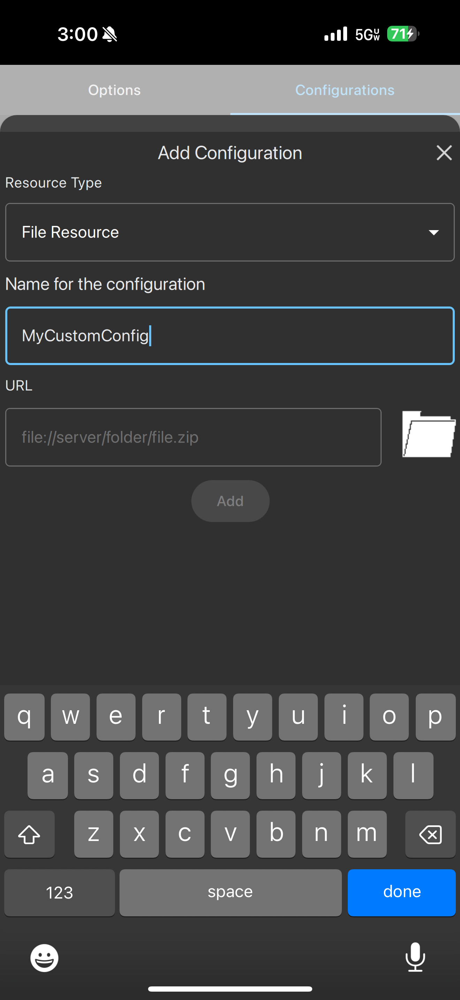

- Click on the folder icon button to browse the file system. In this example, the file that will be used is in the 'Downloads' folder. Tap to open the 'Downloads' folder and tap-hold on the zip file to bring up the context menu. Tap 'Copy'.

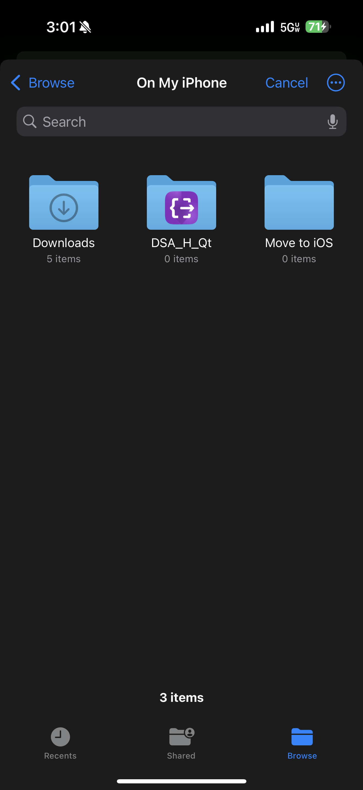
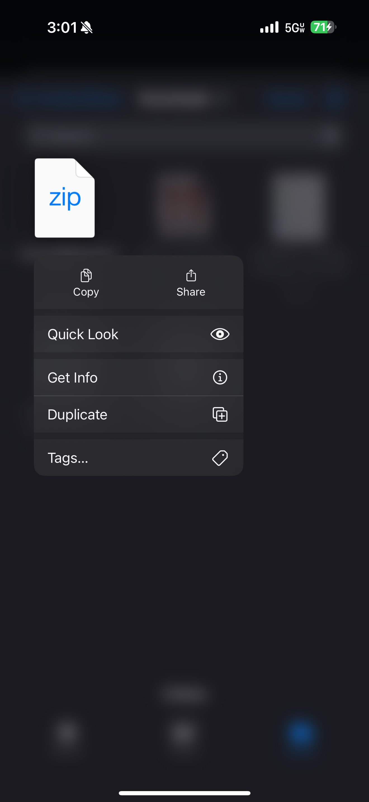

- Navigate back to the previous list of folders and select the application data folder for the DSA app. It should have the DSA application icon symbol on it. In this example it is named 'DSA_H_Qt'. Tap to open it, then tap-hold within the main folder content area to bring up the context menu. If you wish to leave the original copy (in this example in Downloads), click 'Paste'. If not, click 'Move Item Here'.

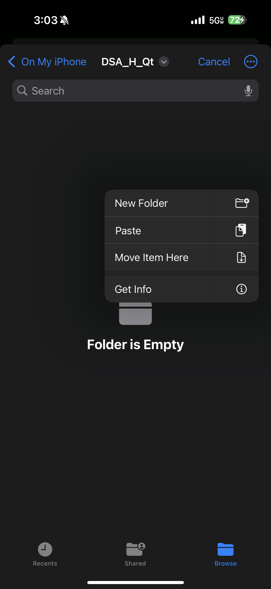

- Now that the zip file is within the DSA application's folder, it can be selected as the file for your new configuration. Tap the new file to select it.

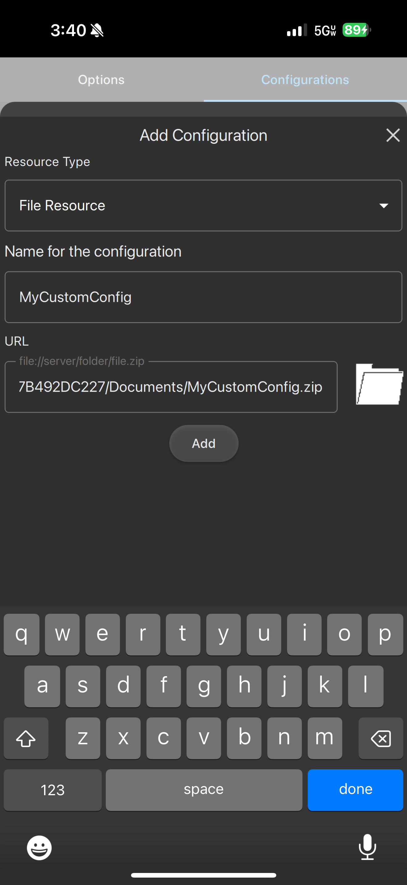

- Click the  icon to download the zip to the device. Once the configuration has been unzipped, you can select the new configuration and reload the application to see the changes. If you are working with large configurations and need to make as much room on your device as possible, you can actually remove the copy of the zip file you have in the DSA app folder. You are also not required to keep the file that was originally downloaded. The DSA app keeps the unzipped file contents internally and does not depend on any of the original zip files. However, if you do remove the zips, you will not be able to restore them from the UI if you have deleted them with the  button. You will need to repeat the download+copy procedure.

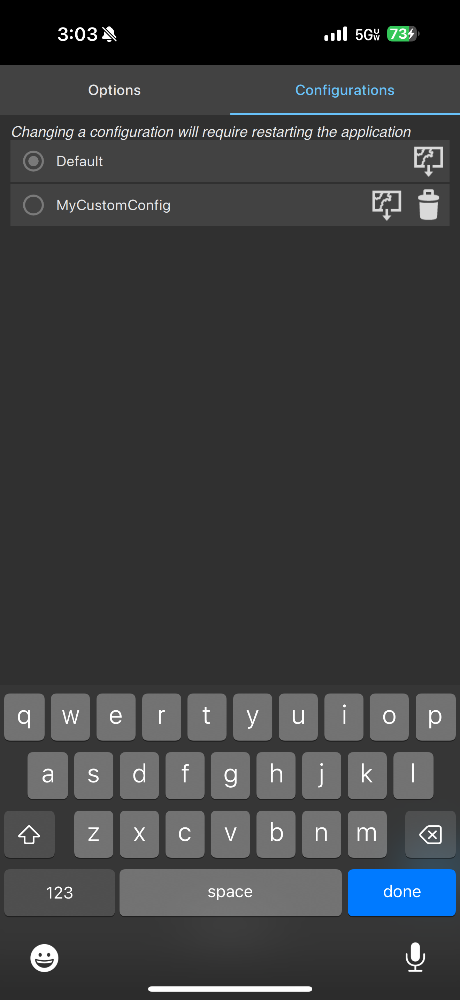

### Android

- The process for creating a new configuration from a downloaded zip file on Android is the same as iOS. The only difference is that you are not required to 'Copy' the zip file from where you have downloaded it into the 'DSA_H_Qt' folder. You can browse to the 'Downloads' folder and tap the file directly. Android applications have the ability to share file resources from outside their application folder. The same details apply for saving space on Android devices. DSA does not require you to keep the original copy. But if you remove it after you have unpacked it, you will not be able to restore it without downloading again.

## ArcGIS Online/Portal Item
- In your portal/org, from your 'Content' page, click 'New Item' and choose 'Application' as the type.
- For the 'Application Type' select the 'Desktop' option
- The 'URL' for the new item is not critical. But if you have a valid organization url you want to associate with it you can put it here.
- In the 'File' input, click the 'Browse' button and select the zip file that you have created for DSA. Click 'Next'.
- The next page you can enter any properties to describe the item and click 'Save'
- Once the upload completes and the item has been created, copy the URL directly from the browser's address bar. The url should have the following format: https://your_organization.maps.arcgis.com/home/item.html?id=51ba17fb287f49e8a634e174bed7af2b
- You can then copy this url into the form in the DSA application shown below. You must also give the configuration a name. The name can be whatever you like. But it must be a valid file system name for the system you are running the application on.

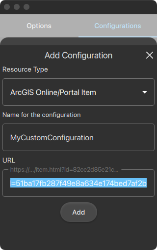
- Click 'Add' to finish adding this zip file to the list.
- You should will see a new entry in the list on the Configurations tab of the Options panel.
- Click the  icon to download the zip to the device.
- Once downloading and unzipping is complete, select the new configuration and click the 'Close' button. The next time you load the app, your new data will be used for configuring the DSA application.

# Migrating DSA data used prior to the 2.0.0 release

The DSA application has a base file structure at which the mapping and configuration data is expected to exist. Prior to the 2.0.0 release of DSA, this location was <%home%>/ArcGIS/Runtime/Data/DSA. At the 2.0.0 release, a new feature was introduced in order to give users the ability to manage multiple configurations for the application. For example, you may wish to use the Esri provided dataset. But you may also have data for a relevant geographic location that covers your area of operations. Prior to the introduction of 'Configurations' the user would need to shutdown the application and copy, move or strategically rename folders in order to load a new set of data and application settings. The Configuration feature adds a new folder level at the very bottom of the structure to allow users to host more than 1 set of DSA data at a time.

The following dialog describes the migration process for MacOS. But the same steps should be followed for Windows and Linux. Although Android users are required to use [Android Studio](https://developer.android.com/studio) to manage the files for DSA, the process is the same. The location of the 'home' folder will be the root of the application(eg. /data/data/com.esri.arcgisruntime.opensourceapps.DSA_Handheld_Qt).

> In our example, we have 3 sets of sample data for 3 different locations in California (Monterey, San Diego and Redlands). The 'DSA' folder in our setup is actually our data for the Monterey location. It has been given the special name 'DSA' which is the required by the application upon startup. We'll rename this folder to its proper name, 'Monterey' which will hide it from the app and allow DSA to create the new folder structure in place.

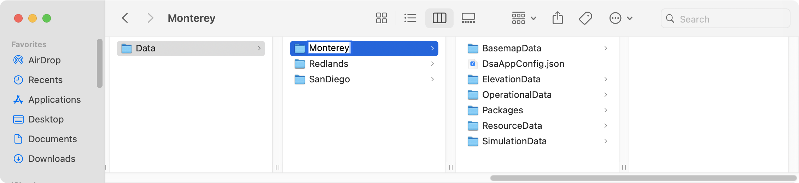

> Next we will launch the new version of DSA. When the app starts, we are asked if we would like to download the default configuration data from Esri. We are configuring our own data so we will click 'No' and close the application.

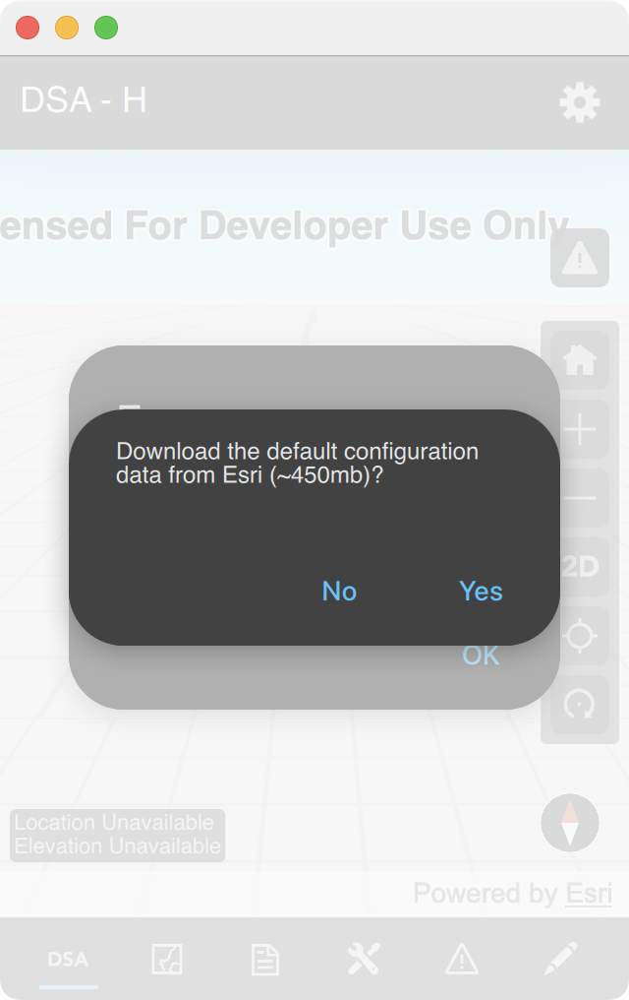

> The startup process for DSA now looks for a file named 'DsaConfigurations.json' in the DSA folder. Since our old DSA folder was renamed, the application created a new 'DSA' folder along with the default version of the 'DsaConfigurations.json' file. There is also a folder called 'Default' where the sample data would be downloaded. We'll remove this folder since we will be using our own data here. Our folders now look like this:

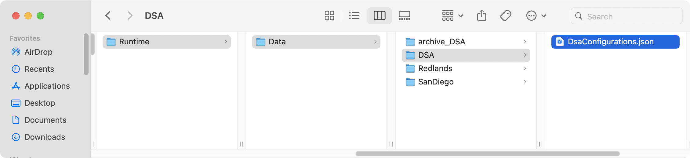

> We can now move our existing folders into the new DSA folder.

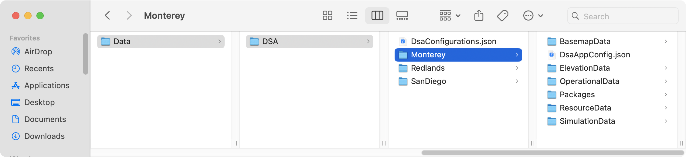

> Now that our data folders are in the right place, we need to update the app configurations management file (`DsaConfigurations.json`) so that the app will be able to find them. Here we'll edit the file in a text editor and make entries for our 3 folders. We start by making 2 copies of the 'Default' configuration object and modifying the names to match. We also set our 'Monterey' configuration to be loaded at startup by setting its 'selected' property to 'true' and the others to false. We don't need the 'url' property for any of our 'configurations,' so we can remove those. The 'url' property is currently only for downloading the default dataset from Esri and is reserved for future use. 

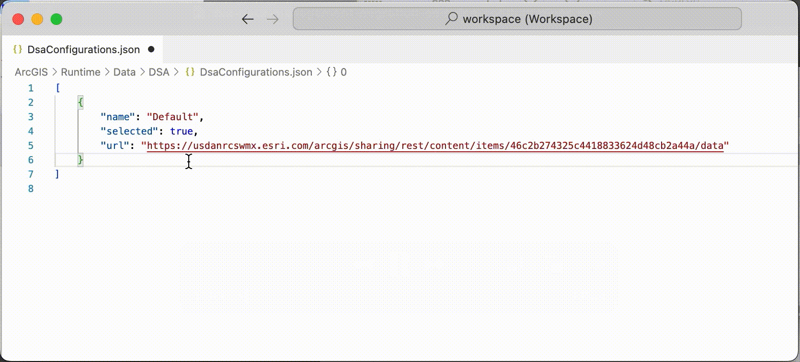

> After updating the configurations management file, we move on to updating the app configuration settings file (`DsaAppConfig.json`) in each data folder. The app configuration file has several file path references that need to be updated. We will take care of this in our Monterey example by doing a find and replace on `/Data/DSA/` with `/Data/DSA/Monterey/`. We include the begin and end slashes here to make sure we don't inadvertently find anything we don't actually want to replace. We repeat this process for the Redlands and SanDiego app configs as well.

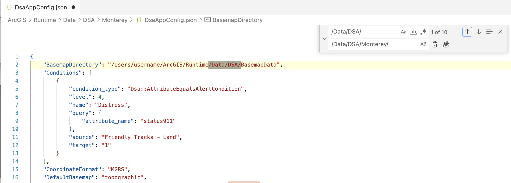

> With the `DsaConfigurations.json` and each of our `DsaAppConfig.json` files update, we can now re-launch the application. Here the 'Handheld' version of DSA is loaded with the Monterey dataset. At this point, we can click the Settings option from the DSA gear menu and look at the Configurations tab. Here we see the 3 configurations we have setup and can choose from any in the list. Switching the selected configuration requires a restart of the application. This completes the migration of our existing data so it can be used with DSA version 2.0.0.

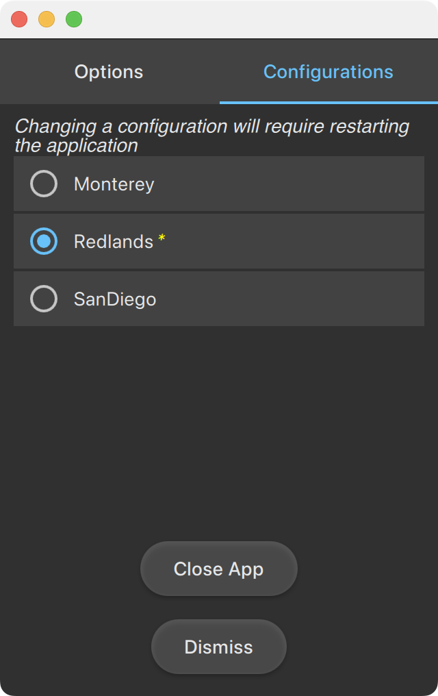

# Manually configuring multiple app configurations using the DSA Configurations Management file

DSA also includes a file to allow you to save more than one configuration of the app. This is useful if you use DSA to demonstrate more than one area of interest, each with different data sources.  The DSA configurations management file is located at `~/ArcGIS/Runtime/Data/DSA/DsaConfigurations.json`. This file can also be placed alongside your DSA executable if you need to make your deployment more portable (for example, if DSA is loaded onto a USB drive). If the file does not already exist when the app starts, it will be created automatically and will refer to the Default DSA data package, referenced in the section above. It is recommended that you use the Configuration tab from the Settings menu to manage your data. But if this approach does not work for your use case, you can use the steps below to set up multiple configurations manually.

To set up an additional 'Configuration' for DSA, create a folder with the desired name at the same level as the 'Default' configuration folder (i.e. "MyLocalData"). Place all your data in the new folder using the structure described in the section above. Update the **DsaConfiguration.json** file to include your new folder, as shown in the screenshot below.

Note: 
- You do not need to provide a `url` value for this configuration
- Be sure to add a comma to separate this from the Default configuration entity
- If you want your configuration to be loaded on startup, set the `selected` value to `true` for your new item and set the Default entity's `selected` property to `false` (as shown in the highlighted section in the image below)

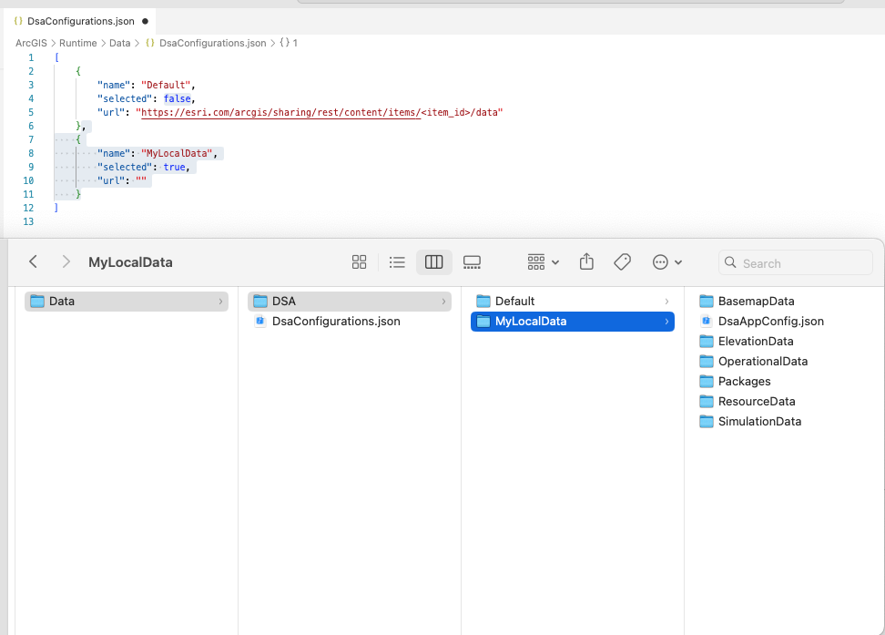

Once the DSA configuration file is updated and saved, the next time you open the app you will see the new configuration listed on the Configurations tab, which is part of the Settings page. Here, you can select which configuration you want activated by selecting it in the list. Changes are made to the DSA configuration file immediately, however, an app restart will be necessary to see the new app configuration reflected in the app.
