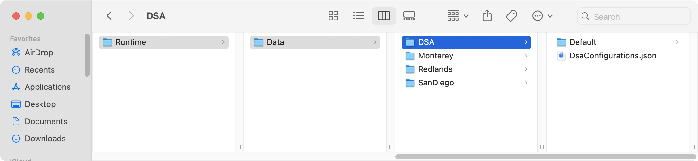

# Migrating DSA data used prior to the 2.0.0 release

The DSA application has a base file structure at which the mapping and configuration data is expected to exist. Prior to the 2.0.0 release of DSA, this location was <%home%>/ArcGIS/Runtime/Data/DSA. At the 2.0.0 release, a new feature was introduced in order to give users the ability to manage multiple configurations for the application. For example, you may wish to use the Esri provided dataset. But you may also have data for a relevant geographic location that covers your area of operations. Prior to the introduction of 'Configurations' the user would need to shutdown the application and copy, move or strategically rename folders in order to load a new set of data and application settings. The Configuration feature adds a new folder level at the very bottom of the structure to allow users to host more than 1 set of DSA data at a time.

The following dialog describes the migration process for MacOS. But the same steps should be followed for Windows, Linux or Android.

> In our example, we have 3 sets of sample data for 3 different locations in California (Monterey, San Diego and Redlands). The 'DSA' folder in our setup is actually our data for the Monterey location. It has been given the special name 'DSA' which is the required by the application upon startup. We'll rename this folder to its proper name, 'Monterey' which will hide it from the app and allow DSA to create the new folder structure in place.

> Next we will launch the new version of DSA. When the app starts, we are asked if we would like to download the default configuration data from Esri. We are configuring our own data so we will click 'No' and close the application.

> The startup process for DSA now looks for a file named 'DsaConfigurations.json' in the DSA folder. Since our old DSA folder was renamed, the application created a new 'DSA' folder along with the default version of the 'DsaConfigurations.json' file. There is also a folder called 'Default' where the sample data would be downloaded. We'll remove this folder since we will be using our own data here. Our folders now look like this:

> We can now move our existing folders into the new DSA folder and rename the 'archive_DSA' folder to its actual location name, Monterey.

> Now that our data folders are in the right place, we need to adjust the `DsaConfigurations.json` file so that the app will be able to find them. Here we'll edit the file in a text editor and make entries for our 3 folders. We start by making 2 copies of the 'Default' configuration object and modifying the names to match. We also set our 'Monterey' configuration to be loaded at startup by setting its 'selected' property to 'true' and the others to false. We don't need the 'url' property for any of our 'configurations' so we can remove those. The 'url' property is currently only for downloading the default dataset from Esri and is reserved for future use. 

> After updating the configurations file, we move on to updating the `DsaAppConfig.json` file in each data folder. The app configuration file has several file path references that need to be updated. We will take care of this in our Monterey example by doing a find an replace on `/Data/DSA/` with `/Data/DSA/Monterey/`. We include the begin and end slashes here to make sure we don't inadvertently find anything we don't actually want to replace. We repeat this process for the Redlands and SanDiego app configs as well.

> With the `DsaConfigurations.json` and each of our `DsaAppConfig.json` files update, we can now re-launch the application. Here the 'Handheld' version of DSA is loaded with the Monterey dataset. At this point, we can click the Settings option from the DSA gear menu and look at the Configurations tab. Here we see the 3 configurations we have setup and can choose from any in the list. Switching the selected configuration requires a restart of the application. This completes the migration of our existing data so it can be used with DSA version 2.0.0.

