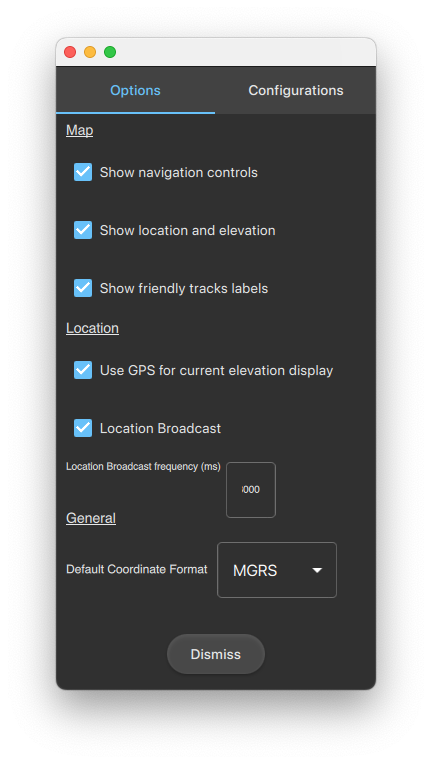

**Contents**

<!-- MDTOC maxdepth:6 firsth1:1 numbering:0 flatten:0 bullets:1 updateOnSave:1 -->

- [Dynamic Situational Awareness (DSA)](#dynamic-situational-awareness-dsa)   
   - [What is DSA?](#what-is-dsa)   
   - [Capabilities](#capabilities)   
   - [Supported platforms](#supported-platforms)   
- [Overview](#overview)   
   - [Tools](#tools)   
      - [Navigation toolbar](#navigation-toolbar)   
      - [Compass](#compass)   
      - [Map context menu](#map-context-menu)   
      - [Tool categories](#tool-categories)   
   - [Settings panel](#settings-panel)   
   - [Map tools](#map-tools)   
      - [Convert X/Y](#convert-xy)   
      - [Feeds](#feeds)   
      - [Add data](#add-data)   
      - [Overlays](#overlays)   
      - [Basemaps](#basemaps)   
- [Workflows and best practices](#workflows-and-best-practices)   
   - [Real-time feeds](#real-time-feeds)   
   - [Exploratory visual analysis](#exploratory-visual-analysis)   
      - [Viewshed](#viewshed)   
      - [Line of sight](#line-of-sight)   
   - [Alerts and conditions](#alerts-and-conditions)   
      - [New alert notification](#new-alert-notification)   
      - [Alerts view](#alerts-view)   
      - [Conditions](#conditions)   
   - [Collaboration](#collaboration)   
      - [Create report tools](#create-report-tools)   
      - [Observation report](#observation-report)   
      - [Markup tools](#markup-tools)   
- [App architecture](#app-architecture)   
- [Get the DSA apps](#get-the-dsa-apps)   
- [App configuration settings](#app-configuration-settings)   
- [Add your own local data](#add-your-own-local-data)   
- [Message simulator](#message-simulator)   

<!-- /MDTOC -->
---

# Dynamic Situational Awareness (DSA)

A peer-to-peer situational awareness app for teams working in the field with specialized communication and mission requirements.

Your vehicle threads its way through the debris-filled streets. Watching out the windows you've seen no movement, but moving on your DSA map are symbols representing other vehicles similar to yours depicting the people sharing your mission. Teammates actively monitor one another's location and status while reporting observations and dangers along the way.

Ahead of the line of vehicles sweeping forward are the advance teams, people on foot going block-by-block: searching, reporting, and acting. Suddenly, an alert on your display demands your attention. An advance team has observed and marked a hazard on the road ahead of you. Your map reveals that an adjoining road has recently been explored and is considered safe. Calling in a specialized unit to deal with the hazard, you reroute and push forward, eager to complete the mission. Moments later, another advance team requests support. The closest vehicle immediately responds, changing course to assist. Other vehicles move in to back them up.


Methodically and meticulously, the team executes the sweep using constant, decentralized communication and situational awareness. As each team locates and marks events, objects and people, your DSA display evolves into an ever-clearer picture.

## What is DSA?

When the operational landscape changes frequently, then rapid, accurate, purpose-built, mission-focused communication is key to success. This is the working domain of the Dynamic Situational Awareness (DSA) open source app built using ArcGIS Runtime SDK. DSA enables physically distributed teams to work as one, maintaining current status on teammates while exploring and illuminating the operational landscape.

DSA is an open source app designed to help you build your own custom field operation apps. Built using [ArcGIS Runtime SDK for Qt], DSA highlights developer best practices for the specific workflows for in-vehicle (mounted) and field (handheld/dismounted) teams who need to dynamically understand their environment and the situation around them.

The DSA apps do not require access to a server. All the data and processing are on the device itself. Display of each local data source may be toggled on or off. Teammates share information such as own location, observation reports, and markup across the peer-to-peer network. The emphasis is on collaboration with other teammates.

These networks are typically not connected to the Internet, are not high-bandwidth, and are not constantly connected - a situation commonly encountered in field operations. This communication network topology is unlike more traditional ArcGIS Runtime apps that leverage the Internet and web servers for communication or web services for some functionality. DSA is designed for use on tactical networks that are secure. Communications between teammates minimizes bandwidth by using compact messages.

<br>

The DSA app suite includes three components:

- _DSA-Vehicle_: intended for a touchscreen embedded desktop environment, mounted in a vehicle.
- _DSA-Handheld_: intended for a touchscreen mobile or small tablet carried by a person.
- _Message Simulator_: a supporting utility app used to simulate messages and position reports on a peer-to-peer network in order to test and demonstrate DSA-Vehicle and DSA-Handheld.

DSA-Vehicle and DSA-Handheld have the same capability, each built for its intended form factor. Both apps feature a streamlined, touch screen UI designed for users who often wear gloves or use a stylus in challenging environments, and a dynamic, high-performance display. The apps can be deployed from a USB drive or side-loaded onto the device along with local data and overlays, depending on an organization's requirements.

## Capabilities

- 3D map with navigation controls
- Own location tracked on the map with various navigation modes
- Read and display local file data including support for both foundation GIS data and overlays
- Uses local data formats supported by ArcGIS Runtime such as Shapefile, GeoTIFF, DTED, NITF, Mobile Mosaic Dataset, GeoPackage, and Mobile Scene Packages
- Support for sharing information over a tactical network which is ad-hoc, peer-to-peer and low-bandwidth, such as
  - Current location reports and distress signal
  - Friendly team position reports
  - Observation reports
  - Markup / sketches
- Support for military symbology with high performance display
- Interactive, on-device, dynamic exploratory analysis with line of sight and viewshed
- Alerts triggered by spatial rules such as geofences
- Coordinate conversion between various notations such as DMS, MGRS, GARS and UTM

## Supported platforms

DSA-Vehicle and DSA-Handheld can be built to run on all platforms supported by [ArcGIS Runtime SDK for Qt]:  Android, Windows, iOS, Linux, and macOS. The message simulator, a testing tool, may be built for Windows, Linux and macOS.

# Overview

## Tools

<br>*Startup display (DSA Vehicle)*

<br>*Startup display (DSA Handheld)*

### Navigation toolbar

The navigation toolbar orients your view of the map. The tool appears vertically on the display's right side. The navigation toolbar allows you to:

|  |  |
| :---: | --- |
|  | Return viewpoint to startup location |
|  | Zoom in and out |
|  | Set viewpoint to 2D perspective (looking straight down) |
|  | Show own location as a moving symbol on the map |
|  | Toggle map navigation control between panning and map rotation |

<br>*Navigation tools orienting the map*

The navigation toolbar can be turned off in the [Settings panel](#settings-panel).

<!-- ##  Compass -->
### Compass

There is a compass on the display's lower-right corner. Its red pointer points to north. Touching the compass will rotate the map so the top points toward north.

The [compass control UI component] is part of ArcGIS Runtime Toolkit for Qt.

### Map context menu

The map's context menu appears when you long-press on the map. The menu varies depending on what is at the map location you press.

| Menu item       | Operation          | Terrain | Own location | Graphic/Feature |
| :---:           | ---                | :---:   | :---:        | :---:           |
| `Coordinates`   | Show coordinates   | X       | X            | X               |
| `Elevation`     | Show elevation     | X       | X            | X               |
| `Follow`        | Follow track       |         | X            | X               |
| `Identify`      | Identify track     | X       | X            | X               |
| `Line of sight` | [Show my line of sight to this track](#line-of-sight) |  | X | X |
| `Observation`   | [Create observation report](#observation-report) | X | X | X |
| `Viewshed`      | [Show viewshed from track](#viewshed)  | X | X | X |

### Tool categories

Tools are categorized by workflows, shown on the toolbar. Select one of the workflows on the toolbar to select tools to be displayed on the command bar.

- Vehicle app: Toolbar appears vertically down the display's left side.
- Handheld app: Toolbar horizontally across the bottom of the display.

The tool categories include:

|  |  |
| :---: | --- |
|  | Return command bar to start |
|  | [Map tools](#map-tools) (manage map elements) |
|  | [Create report tools](#create-report-tools) (such as observation reports) |
|  | [Analysis tools](#exploratory-visual-analysis) (viewshed, line of sight) |
|    | [Alert tools](#alerts-and-conditions) (proximity, geofence, attribute-driven) |
|   | [Markup tools](#markup-tools) (sketching) |

## Settings panel

<br>*Settings panel (DSA Vehicle)*

The settings panel accesses the app's About information, app settings, and app close (for desktop platforms).

- Vehicle app: Control is at the bottom of the tools category panel on the left of the display.
- Handheld app: Control is in the toolbar when the DSA category is selected.

<!-- TODO - Verify the following paragraph: Some settings are persisted, but ALL of them? -->

When you change settings, they are persisted in the configuration file.

## Map tools

### Convert X/Y


It is common for analysts to work across various systems that use different coordinate notation formats to pinpoint places on the Earth. Working with multiple organizations simultaneously, each may require or provide coordinate information in different notation formats. You may need to consume, translate, relay, and/or display those notations. For example, you may have a coordinate expressed as Decimal Degrees (DD) notation with five decimal places, and you want to use that location in another system that expects Military Grid Reference System (MGRS) notation with whitespace between the grid zone designator, the 100km square identifier, and the numerical eastings and northings.

The Convert X/Y tool accepts a location in any supported coordinate notation or directly from the map and provides that location in different notation. The tool lets you copy converted notations for use elsewhere in the app, such as in an Observation report.

<br>*Convert X/Y Tool (DSA Handheld)*

<!--  -->

<ol type="a">
  <li>The location, in the notation indicated in <b>b</b> (the last selected notation).</li>
  <li>A button labeled with acronym for the notation in <b>a</b>. Tapping this button adds notations. This control can display multiple notations simultaneously.</li>
  <li>The location expressed in the previously-selected notation.</li>
  <li>A menu to copy this notation to the clipboard or delete this notation from the display.</li>
  <li>Zoom the map to the location.</li>
  <li>Flash an indicator at the location.</li>
  <li>Change the location using text.</li>
  <li>Change the location by pointing on the map.</li>
  <li>Minimize this tool.</li>
</ol>

***Developer tip:*** This tool relies heavily on the Runtime API class [`CoordinateFormatter`]. You can include in your app only the supported coordinate systems that you are interested in.

### Feeds


<br>*Message feeds tool (DSA Vehicle)*

Feeds are streams of information broadcast over the network. When information is received over a feed, it is translated into something the app can use, like a map symbol in an overlay or an alert. The Feed tool controls which feeds are represented on your display. See more information in the section [Real-time feeds](#real-time-feeds).

### Add data


<br>*Add Local Data tool (DSA Vehicle)*

Some [overlays](#overlays) get their information from local data sources, such as features and aerial or satellite images. The map also uses a local data source for elevation surface information. Use the Add Data tool to make local data sources available within your app.

Specify the folders the app searches for local data using your [App configuration settings](#app-configuration-settings). Local data that has been found on your device is listed by this tool. Any data supported by ArcGIS Runtime SDKs can be used, including:

- [GeoPackage]
- [Tile package] (TPK)
- [Mobile geodatabase]
- KML
- [Raster formats], including:
  - JPEG / JPEG 2000
  - PNG
  - IMG
  - Raster Product Format (RPF) - CADRG and CIB
  - National Imagery Transmission Format (NITF)
  - Digital Terrain Elevation Data (DTED)
  - [Mobile Mosaic Dataset]
  - MrSID

- [Shapefile] (SHP)
- [Scene Layer Package] (SLPK)

### Overlays


<br>*Overlays tool (DSA Vehicle)*

A set of overlays manages what is drawn on the map. Overlays may be reordered, zoomed to, or deleted. Manage overlays to present information on the map that is most important to you. Add new overlays with the [Add data](#add-data) tool.

")<br>*Overlays tool context menu (DSA Vehicle)*

### Basemaps


<!--  -->

<br>*Basemaps tool (DSA Vehicle)*

A [basemap] provides a background of geographical context for the symbology on the map. Use this tool to choose the basemap you want to see. Another basemap may be selected at any time. Specify the folder locations the app searches for basemaps loaded on your device using your [App configuration settings](#app-configuration-settings).

***Developer tip:*** You have options when it comes to the basemaps you want to use, including:

- Decide which basemaps you want to provision from among those that come with this DSA app.
- Download basemaps for offline use from [Tile Basemap group on ArcGIS Online].
- Provision your app with basemaps of your own design.
- Try [Tile Package Kreator] from Esri, available on GitHub.

# Workflows and best practices

## Real-time feeds

Reports are crucial for field operators who update one another about what is happening and where it is happening.
Typically, a report contains information such as descriptions, map coordinates, a symbol ID, and many other things. These reports are typically sent via messages over low bandwidth networks or radios. Organizations use different standards to specify the format and content of reports and methods used to transport messages from one device to another. Therefore, DSA focuses on the best practices for developers to display and work with these messages in a map.

DSA includes some generic modular components for receiving and sending these messages over the network (the `DataListener` and `DataSender` classes) with the intention that developers can easily understand how to integrate their own message formats and transport mechanisms into their own map.

DSA apps support several generic message feeds.

| | |
| --- | --- |
| SA Events |  Situational Awareness (SA) events, using the Cursor on Target (CoT) format. |
| Friendly Tracks – Land |  Position Reports from land-based friendly team members. Track information is symbolized using a MIL-STD-2525C symbol ID code and draped on the elevation surface. |
| Friendly Tracks – Air | Position reports from friendly airborne team members. Track information is symbolized using a MIL-STD-2525C symbol ID code and are displayed using a z-value as an absolute distance above the elevation surface. |
| Observation Reports | Observations made while in the field, using a typical "SALUTE" format (Size, Activity, Location, Unit ID, Time, Equipment). |
| Situation Reports | View teammates' current situation. |
| EOD Reports | Explosive Ordinance Disposal (EOD) mission reports. |
| Sensor Observations | Observations made by sensors in the field. |

***Developer tips:***

- DSA serializes feeds as XML, which is then converted into bytes. Next, the bytes are broadcast as datagrams over a specific UDP port. DSA apps are configured to listen on the same UDP ports, so when incoming datagrams are received, the messages are deserialized and displayed on the map.
- This app uses [dynamic rendering] for graphics.
- Military symbols are displayed using a [dictionary renderer].

## Exploratory visual analysis

Exploratory analysis tools combine information such as feature location, your location, and elevation to answer questions about the current operational environment. Analysis is continuously updated as the environment changes, leveraging the GPU of the device and the data that is drawn on the map. The results of an analysis are presented in an overlay that can be [managed like other overlays](#overlays).

### Viewshed


<br>*Viewshed analysis (DSA Vehicle)*

[Viewshed analysis] is a type of visibility analysis that shows the visible and obstructed areas within a directed field of view. Viewshed analysis shows you the areas of the scene that are visible from a given observer, determined by the terrain (represented by an elevation surface), buildings and other 3D features (represented by scene layers, graphics, and so on), and the properties of the observer. A viewshed is adjustable to show what is visible within a specified distance in a certain direction or all directions. Areas that are visible from the location are highlighted in green, and not-visible areas are highlighted in red. As the location moves, the viewshed analysis is recalculated.

### Line of sight


<br>*Line of sight analysis (DSA Vehicle)*

[Line of sight analysis] shows visibility along a line drawn between an observer and a target location. The result shows which segments of the line can be seen by the observer and which segments are blocked by an obstruction. The line from the observer is green until it encounters a barrier, and beyond that the line is red. As the observer and the target move, the line of sight analysis is recalculated.

***Developer tips:***

- Both viewshed and line of sight analysis are calculated using the GPU and operate only on the data displayed on the map. This means that the accuracy of these analyses are limited by the current resolution of the displayed data and the elevation surface.

## Alerts and conditions

Alerts are events that are triggered when certain conditions, or rules, are met against the real-time feeds and messages displayed in the app.  These conditions are defined by the user and constantly evaluated as new messages are received and updated.  Spatial conditions can be created, such as geofences ("within area of") or distance ("within distance of"), or attribute conditions, such as "status911 = true" or "speed < 50".

### New alert notification

The user is notified of new alerts on the Tool Categories bar. The number in the red circle indicates any new alerts that have been added to the Alerts View since it was last opened.

<br>*New alerts indicator (DSA Handheld)*

### Alerts view


<br>*Alerts view tool (DSA Handheld)*

Use the View tool to view a list of active alerts. As alerts become active or inactive, the app updates the list. You can filter the list by priority, and zoom to, highlight, or dismiss an individual view on the list.

### Conditions


<br>*Alert conditions tool (DSA Handheld)*

When you select the Conditions tool, the app presents a list of the defined alert conditions. When you press CREATE NEW, a wizard asks for details about the conditions that will trigger the new alert.

Create a spatial condition to alert when something enters a polygon or comes within a certain distance of an area or object. Create an attribute condition to alert when an attribute is a specified value for an object provided by a feed. You can use any available attribute on the object. The details you are prompted for depend on the type of condition: spatial or attribute. Conditions are persisted in the app's [configuration file](#app-configuration-settings).

For a spatial condition:

- Priority: Low, medium, high, or critical
- Type: Spatial
- Condition name
- The source [feed](#feeds) to monitor (which can be your location)
- The type of trigger: within an area, or within a given distance of other (target) features
- The data source containing a target features, either a specific feature or all features in that data source

For an attribute condition:

- Priority: Low, medium, high, or critical
- Type: Attribute
- Condition name
- The source [feed](#feeds) to monitor (which can be your location)
- The name of the attribute to monitor
- The value of the attribute that will trigger an alert

For testing spatial conditions, DSA uses the [GeometryEngine] class from the ArcGIS Runtime SDK, which allows for fast calculations of spatial relationships, distances, and so forth. To manage the relationship between the conditions which are being evaluated against the real-time feeds, DSA implements a quadtree.

Due to the real-time, dynamic nature the DSA app, the information used can constantly change. The location of other units or reports is updated as the mission progresses, while attributes can change to reflect new information as it is received. This constantly changing picture poses a challenge when performing traditional GIS analysis since queries must be re-run when the underlying data has been updated.

In particular, performing spatial analysis (for example, a geofence) against many moving entities can be computationally expensive. To help alleviate this cost, the `GeometryQuadtree` can be used to create a spatial look-up structure for working with multiple [Geometry] objects. The quadtree is built to cover the full extent (an [Envelope] object) of the geometry and each object is recursively assigned to a leaf or node of the tree up to a maximum depth. The maximum depth of the tree can be assigned at creation time - generally 8 offers a good trade-off between granularity and the time taken to build the tree. The tree is a sparse structure, that is, any nodes which contain no geometry are removed. Once built, this structure offers very fast lookup of the candidate geometries which may intersect with a given query geometry. For performance reasons, the tree uses bounding box intersection tests only. The results are returned as a list of geometry objects which can be used for exact intersection tests using the [GeometryEngine]. The quadtree will connect to changes to the underlying geometry objects and can also be updated to include new features.

***Developer tip*** Building the quadtree is the most expensive part of the operation so care should be taken to do this only when required. For example, the quadtree is a useful tool where there are many features which change infrequently (for example, a static feature layer) but would be less appropriate for a small number of constantly changing features (for example, your current location). For very large datasets, the cost to build the tree may be very high, so it may be worth moving its construction to a background thread to avoid blocking the GUI thread.

## Collaboration

You can use DSA to collaborate with teammates by sharing [observation reports](#observation-report) or [markup overlays](#markup-tools) over the peer-to-peer network.

### Create report tools


Create reports to inform teammates of activities or entities in the area. Currently, DSA supports creating observation reports.

### Observation report


When you select the observation report tool, a wizard asks for details to include:

- The reporting unit's name (default is your unit)
- The size of the observation
- The observed activity
- The observation location (default is your location)
- Description of the observation
- The date and time of the observation (default is current time)

***Developer tip:*** You can follow the create report patterns used by this app to create your own reports with their own purpose and attributes and share those reports with your teammates.

### Markup tools

 

<br>*Markup tools*

The purpose of a markup is to quickly sketch and share drawings overlaying the map. Each markup appears as an overlay on the map. Use this tool to sketch a markup and share it with your teammates.

Because each markup is in its own overlay, including overlays you have received from teammates, you can manage markups with the [Overlays tool](#overlays).

Use these tools to create markups.

| | |
| --- | --- |
|  | Draw lines on the display using your finger or pointing device. |
|  | Set the line color. You can change colors as you go, creating markup with multiple colors. |
|  | Clear all the lines of the current markup. |
|  | The share control appears on the display after you start drawing a new markup. Use Share to finish your markup, give it a name and send it to all teammates. |

Markups are serialized as individual JSON files in the folder specified by the `OperationalOverlays` parameter in the [app configuration file](#app-configuration-settings). The JSON schema for markup is the same one that's used for Explorer. Refer to the [Explorer for ArcGIS markup documentation] to see how Explorer similarly shares markup.

***Developer tips:***

- DSA uses a [Graphic] object to create markup. Graphics are for temporary and transient things like sketches and tracks. After you share the markup, it is added to a overlay as a [FeatureCollection] object which is persisted like any other overlay. This is a common ArcGIS Runtime pattern to use graphics for transient objects and a FeatureCollection for persisted objects.
- DSA serializes a markup as JSON, which is then converted into bytes. Next, the bytes are broadcast as datagrams over a specific UDP port. All apps are configured to listen on the same UDP ports, so when incoming datagrams are received, they are deserialized and added to the map as a markup overlay.

# App architecture

The apps follow a commonly-used design pattern of using C++ for most program logic and using Qt Quick (QML) for UI development. DSA apps are written with ArcGIS Runtime SDK for Qt C++ API and the SDK Toolkit. C++ generally performs procedural code faster than Qt Quick which uses a JavaScript engine for procedural code.

[Qt Quick from the Qt Company] is excellent for UI development, simplifying the design and execution of a professional-looking, dynamic UI. Qt Quick has many out-of-the-box visualization options such as animation and control arrangement.

ArcGIS Runtime for Qt C++ API provides ArcGIS Runtime capabilities to manage, display, analyze, and interact with spatial data. The C++ API controls the display, reads data from local storage, symbolizes features, and so forth.

The SDK Toolkit includes tools to fulfill specific mission requirements, such as displaying a north arrow, measuring distance, or converting coordinate notations.

All DSA tools inherit the Toolkit's [`AbstractTool`] base class so that all tools have a common interface. Tools are exposed as controller classes (which may have associated model classes), and the UIs are implemented using QML to cleanly separate the UI and business logic, as well as effectively manage cross-API dependency. The app makes heavy use of the Toolkit's Resource Provider so that information can be shared between classes without creating cross dependencies between tools.

# Get the DSA apps

For convenience, you can try out the DSA apps compiled for [Windows] and [Android], and the [local data] from ArcGIS Online. Please note that these compiled versions of the app are examples only, and should not be used in a production environment.

# App configuration settings

You can customize aspects of the DSA apps via a configuration file. When the DSA app runs, the app will create a new configuration file if one is not found on local storage. When the app opens the configuration file, the file is read and its values used by the app for that run. Some settings may be changed at run time using the [Settings panel](#settings-panel). Those changes are persisted in the configuration file.

The configuration file is located at `~/ArcGIS/Runtime/Data/DSA/DsaAppConfig.json`, where `~` is `%username%`/`C:/Users/<username>` on Windows, `$HOME` on Unix, and `/sdcard` on Android.

The following lists some of the configuration settings that you can change.

| Key | Default value | Description |
|-----|-----|-----|
| BasemapDirectory | `**/BasemapData` | Location the basemap picker searches for basemap data |
| Conditions |`*`| JSON array of custom JSON representing a condition |
| CoordinateFormat | `MGRS` | String representing the default coordinate format used |
| CurrentPackage | "" | String representing the path to a Mobile Scene Package (.mspk) file |
| DefaultBasemap | `Topographic` | Name of the TPK file to use as the basemap, without the tpk file extension (not case sensitive) |
| DefaultElevationSource | `**/ElevationData/CaDEM.tpk` | Default elevation source |
| ElevationDirectory | `**/ElevationData` | Location to search for DEMs and LERC encoded TPK |
| GpxFile | `**/SimulationData/MontereyMounted.gpx` | GPX file to use for simulating location |
| InitialLocation  |`*`| JSON of center, distance, heading, pitch, roll |
| LocationBroadcastConfig |`*`| JSON for message type and port to use |
| LocalDataPaths | `**`, `**/OperationalData` | Locations that the Add Local Data tool searches for GIS Data. This should be a comma separated list. Folders are NOT recursively searched |
| MessageFeeds |`*`| Details of message feeds used in DSA |
| ResourceDirectory | `**/ResourceData` | Location to search for images, style files, and other similar files used by the app |
| RootDataDirectory | `**` | Root data location |
| SceneIndex | `-1` | Integer representing the index of the Scene to load from the CurrentPackage |
| SimulateLocation | `true` | Whether to simulate location or use your device's location |
| SimulationDirectory | `**/SimulationData` | Location to search for GPX and Message Simulation files |
| UnitOfMeasurement | `meters` | Default unit of measurement for distance |
| UserName | your device's name | Name that identifies your device on the network |

 `*` - See the config file for details.

 `**` - Default data path: `~/ArcGIS/Runtime/Data/DSA`.

# Add your own local data

The default data path to local data is `~/ArcGIS/Runtime/Data/DSA`. If you wish to change this, reference the above table, and update the various paths.

The default data directory should look like this:

```xml
~/ArcGIS/Runtime/Data/DSA/..
                          BasemapData/
                          OperationalData/
                          Packages/
                          SimulationData/
                          ResourceData/
                          ElevationData/

```

You can learn more in the Guide topic [Deploy local offline data].

# Message simulator

The message simulator app broadcasts simulated messages over the peer-to-peer network. It is not meant for end users in the field, but rather provides a way to test and demonstrate the capabilities of DSA apps by providing a simulated environment through messages. The message simulator broadcasts messages over a given port. DSA-Vehicle and DSA-Handheld apps can listen to the same port for new messages and update their displays as messages are received.

The message simulator can only consume one simulation file at a time. You can create a script to run multiple simulation instances at the same time from the command line. For example on Windows, run `DSA_MessageSimulator_Qt.exe -h` to see the usage options:

```xml
Available command line parameters:
  -h                     Print help and exit
  -c                     Console mode (no GUI)
Parameters available only in console mode:
  -p <port number>       Port number: Required
  -f <filename>          Simulation file: Required
  -q <frequency>         Frequency (messages per time unit); default is 1.0
  -t <time unit>         Time unit for frequency; valid values are seconds,
                         minute, and hour; default is second
  -l                     Simulation loops through simulation file
  -s                     Silent mode; no verbose output
```

<!--- Bibliography (using reference-style Markdown link definitions) -->
<!--- See https://github.com/adam-p/markdown-here/wiki/Markdown-Cheatsheet#links -->

<!-- GitHub repos -->

[Tile Package Kreator]: https://github.com/Esri/TilePackageKreator

<!-- Apps and data hosted on AGOL -->

[Android]: http://links.esri.com/exampleapps/dsaqt/app/android

[local data]: http://links.esri.com/exampleapps/dsaqt/localdata

[Windows]: http://links.esri.com/exampleapps/dsaqt/app/windows

[Tile Basemap group on ArcGIS Online]: https://www.arcgis.com/home/group.html?id=3a890be7a4b046c7840dc4a0446c5b31#overview

<!-- Runtime landing pages -->

[ArcGIS Runtime SDK for Qt]: https://developers.arcgis.com/qt

<!-- Guide references -->

[SDK Guide]: https://developers.arcgis.com/qt

[Deploy local offline data]: https://developers.arcgis.com/qt/latest/qml/guide/deploy-local-offline-data-with-your-app.htm

[dictionary renderer]: https://developers.arcgis.com/qt/latest/cpp/guide/display-military-symbols-with-a-dictionary-renderer.htm

[dynamic rendering]: https://developers.arcgis.com/qt/latest/cpp/guide/performance-considerations.htm#ESRI_SECTION2_C5226FAF302547FD96721CA898FF86F2

[Explorer for ArcGIS markup documentation]: https://doc.arcgis.com/en/explorer/ipad/help/markup.htm

[GeoPackage]: https://developers.arcgis.com/qt/latest/cpp/guide/add-raster-data.htm#ESRI_SECTION1_543960DAEED645B7864351FD2BFC98BB

[Line of sight analysis]: https://developers.arcgis.com/qt/qml/sample-code/line-of-sight-geoelement/

[Mobile geodatabase]: https://developers.arcgis.com/qt/latest/cpp/guide/take-a-layer-offline.htm#ESRI_SECTION2_6AB16F528AB842AEACDB449A73021786

[Mobile Mosaic Dataset]: https://developers.arcgis.com/qt/latest/cpp/guide/add-raster-data.htm#ESRI_SECTION1_56B9BE5F631B4E4B9E458490CF816950

[Raster formats]: https://developers.arcgis.com/qt/latest/cpp/guide/add-raster-data.htm#ESRI_SECTION1_D3B90253C5A945BEB79E521C344E945D

[Scene Layer Package]: https://developers.arcgis.com/qt/latest/cpp/guide/build-a-new-scene.htm#ESRI_SECTION1_12529039599C40E6989BE3887956FA0B

[Shapefile]: https://developers.arcgis.com/qt/latest/cpp/api-reference/esri-arcgisruntime-shapefilefeaturetable.html

[Tile package]: https://developers.arcgis.com/qt/latest/cpp/guide/work-with-offline-layers.htm#ESRI_SECTION1_AFE57774DA124157973E8598DB68F3FA

[Viewshed analysis]: https://developers.arcgis.com/qt/qml/sample-code/viewshed-camera/

<!-- API references  -->

[`AbstractTool`]: https://developers.arcgis.com/qt/latest/toolkit/api-reference/esri-arcgisruntime-toolkit-abstracttool.html

[basemap]: https://developers.arcgis.com/qt/latest/cpp/api-reference/esri-arcgisruntime-basemap.html

[compass control UI component]: https://developers.arcgis.com/qt/ui-components/

[Envelope]: https://developers.arcgis.com/qt/latest/cpp/api-reference/esri-arcgisruntime-envelope.html

[FeatureCollection]: https://developers.arcgis.com/qt/latest/cpp/api-reference/esri-arcgisruntime-featurecollection.html

[Geometry]: https://developers.arcgis.com/qt/latest/cpp/api-reference/esri-arcgisruntime-geometry.html

[GeometryEngine]: https://developers.arcgis.com/qt/latest/cpp/api-reference/esri-arcgisruntime-geometryengine.html

[Graphic]: https://developers.arcgis.com/qt/latest/cpp/api-reference/esri-arcgisruntime-graphic.html

<!-- External website references  -->

[Qt Quick from the Qt Company]: http://links.esri.com/qt-esri-referral/qt-quick
